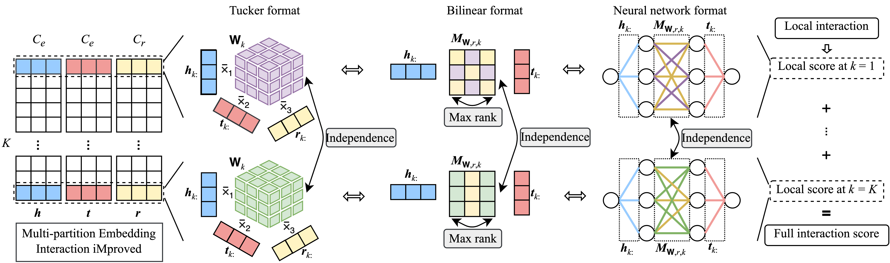

# MEIM: Multi-partition Embedding Interaction iMproved beyond block term tensor format


***Figure 1:** Architecture of MEIM with independent core tensors and max-rank mapping matrices in three different views: Tucker format, parameterized bilinear format, and neural network format.*

This code implements the MEIM knowledge graph embedding method in the paper [MEIM: Multi-partition Embedding Interaction Beyond Block Term Format for Efficient and Expressive Link Prediction]() (IJCAI 2022). MEIM method introduces two new aspects, namely independent core tensor for ensemble boosting effects and soft orthogonality for max-rank relational mapping, in addition to multi-partition embedding in MEI method. The code is optimized for high performance in PyTorch and demonstrates several important techniques in KGE.

Knowledge graph embedding methods (KGE) aim to learn low-dimensional vector representations of entities and relations in knowledge graphs. The models take input in the format of triples (h, t, r) denoting head entity, tail entity, and relation, respectively, and output their embedding vectors as well as solving the link prediction task. For more information, please see our paper.

## Installation
- Clone the repository to your local machine: `git clone https://github.com/tranhungnghiep/MEIM-KGE/`
- Go to the repository directory: `cd MEIM-KGE/`
- Install required packages, you may install in a separate environment: `pip install -r requirements.txt`

## How to run
Go to the source directory (`cd src/`) and run the following commands.

### To reproduce MEIM:
On WN18RR, MEIM 3x100:
```shell script
python main.py --seed 7 --config_id "rep" --gpu 0 --model MEIM --in_path ../datasets/wn18rr/ --out_path ../result/ --K 3 --Ce 100 --Cr 100 --core_tensor nonshared --reuse_array torch1pin --sampling kvsall --loss_mode softmax-cross-entropy --batch_size 1024 --max_epoch 1000 --opt_method adam --amsgrad 0 --lr 3e-3 --lr_scheduler exp --lr_decay 0.99775 --lambda_ent 0.0 --lambda_rel 0.0 --lambda_params 0.0 --label_smooth 0.0 --constraint "" --to_constrain "" --mapping_constraint orthogonal --lambda_ortho 1e-1 --lambda_rowrelnorm 5e-5 --droprate_w 0.0 --droprate_r 0.0 --droprate_mr 0.0 --droprate_h 0.71 --droprate_mrh 0.67 --droprate_t 0.0 --norm bn --n_w 0 --n_r 0 --n_mr 0 --n_h 1 --n_mrh 1 --n_t 0 --n_sepK 1
```
On FB15K-237, MEIM 3x100:
```shell script
python main.py --seed 7 --config_id "rep" --gpu 0 --model MEIM --in_path ../datasets/fb15k-237/ --out_path ../result/ --K 3 --Ce 100 --Cr 100 --core_tensor nonshared --reuse_array torch1pin --sampling 1vsall --loss_mode softmax-cross-entropy --batch_size 1024 --max_epoch 1000 --opt_method adam --amsgrad 1 --lr 3e-3 --lr_scheduler exp --lr_decay 0.99775 --lambda_ent 0.0 --lambda_rel 0.0 --lambda_params 0.0 --label_smooth 0.0 --constraint "" --to_constrain "" --mapping_constraint "" --lambda_ortho 0.0 --lambda_rowrelnorm 0.0 --droprate_w 0.0 --droprate_r 0.0 --droprate_mr 0.0 --droprate_h 0.66 --droprate_mrh 0.67 --droprate_t 0.0 --norm bn --n_w 0 --n_r 0 --n_mr 0 --n_h 1 --n_mrh 1 --n_t 0 --n_sepK 0
```
On YAGO3-10, MEIM 5x100:
```shell script
python main.py --seed 7 --config_id "rep" --gpu 0 --model MEIM --in_path ../datasets/YAGO3-10/ --out_path ../result/ --K 5 --Ce 100 --Cr 100 --core_tensor nonshared --reuse_array torch1gpu --sampling 1vsall --loss_mode softmax-cross-entropy --batch_size 1024 --max_epoch 1000 --opt_method adam --amsgrad 1 --lr 3e-3 --lr_scheduler exp --lr_decay 0.995 --lambda_ent 0.0 --lambda_rel 0.0 --lambda_params 0.0 --label_smooth 0.0 --constraint "" --to_constrain "" --mapping_constraint orthogonal --lambda_ortho 1e-3 --lambda_rowrelnorm 0.0 --droprate_w 0.0 --droprate_r 0.0 --droprate_mr 0.0 --droprate_h 0.1 --droprate_mrh 0.15 --droprate_t 0.0 --norm bn --n_w 0 --n_r 0 --n_mr 0 --n_h 1 --n_mrh 1 --n_t 0 --n_sepK 0
```

### To reproduce MEI with comparable sizes:
On WN18RR, MEI 3x115:
```shell script
python main.py --seed 7 --config_id "rep" --gpu 0 --model MEI --in_path ../datasets/wn18rr/ --out_path ../result/ --check_period 5 --K 3 --Ce 115 --Cr 115 --core_tensor shared --reuse_array torch1pin --sampling kvsall --loss_mode softmax-cross-entropy --batch_size 1024 --max_epoch 1000 --opt_method adam --amsgrad 0 --lr 3e-3 --lr_scheduler exp --lr_decay 0.99775 --lambda_ent 0.0 --lambda_rel 0.0 --lambda_params 0.0 --label_smooth 0.0 --constraint "" --to_constrain "" --mapping_constraint "" --lambda_ortho 0 --lambda_rowrelnorm 0 --droprate_w 0.0 --droprate_r 0.0 --droprate_mr 0.0 --droprate_h 0.71 --droprate_mrh 0.67 --droprate_t 0.0 --norm bn --n_w 0 --n_r 0 --n_mr 0 --n_h 1 --n_mrh 1 --n_t 0 --n_sepK 1
```
On FB15K-237, MEI 3x124:
```shell script
python main.py --seed 7 --config_id "rep" --gpu 0 --model MEI --in_path ../datasets/fb15k-237/ --out_path ../result/ --K 3 --Ce 124 --Cr 124 --core_tensor shared --reuse_array torch1pin --sampling 1vsall --loss_mode softmax-cross-entropy --batch_size 1024 --max_epoch 1000 --opt_method adam --amsgrad 1 --lr 3e-3 --lr_scheduler exp --lr_decay 0.99775 --lambda_ent 0.0 --lambda_rel 0.0 --lambda_params 0.0 --label_smooth 0.0 --constraint "" --to_constrain "" --mapping_constraint "" --lambda_ortho 0.0 --lambda_rowrelnorm 0.0 --droprate_w 0.0 --droprate_r 0.0 --droprate_mr 0.0 --droprate_h 0.66 --droprate_mrh 0.67 --droprate_t 0.0 --norm bn --n_w 0 --n_r 0 --n_mr 0 --n_h 1 --n_mrh 1 --n_t 0 --n_sepK 0
```
On YAGO3-10, MEI 5x106:
```shell script
python main.py --seed 7 --config_id "rep" --gpu 0 --model MEI --in_path ../datasets/YAGO3-10/ --out_path ../result/ --K 5 --Ce 106 --Cr 106 --core_tensor shared --reuse_array torch1gpu --sampling 1vsall --loss_mode softmax-cross-entropy --batch_size 1024 --max_epoch 1000 --opt_method adam --amsgrad 1 --lr 3e-3 --lr_scheduler exp --lr_decay 0.995 --lambda_ent 0.0 --lambda_rel 0.0 --lambda_params 0.0 --label_smooth 0.0 --constraint "" --to_constrain "" --mapping_constraint "" --lambda_ortho 0.0 --lambda_rowrelnorm 0.0 --droprate_w 0.0 --droprate_r 0.0 --droprate_mr 0.0 --droprate_h 0.1 --droprate_mrh 0.15 --droprate_t 0.0 --norm bn --n_w 0 --n_r 0 --n_mr 0 --n_h 1 --n_mrh 1 --n_t 0 --n_sepK 0
```

## Results
The above hyperparameters were tuned for MRR on the validation sets, higher MRR is better. 

MEIM outperforms MEI, achieves new state-of-the-art results using quite small number of parameters.

| WN18RR              | MR | MRR | H@1 | H@3 | H@10 |
| ------------------- | - | - | - | - | - |
| MEI 3x115, valid set| 3114.822 | 0.481 | 0.447 | 0.493 | 0.544 |
| MEIM 3x100, valid set| 2117.390 | 0.499 | 0.460 | 0.513 | 0.574 |
| MEI 3x115, test set | 3267.743 | 0.481 | 0.444 | 0.496 | 0.551 |
| MEIM 3x100, test set | 2434.371 | 0.499 | 0.458 | 0.518 | 0.577 |

| FB15K-237           | MR | MRR | H@1 | H@3 | H@10 |
| ------------------- | - | - | - | - | - |
| MEI 3x124, valid set| 137.179 | 0.371 | 0.278 | 0.406 | 0.556 |
| MEIM 3x100, valid set| 131.311 | 0.375 | 0.282 | 0.410 | 0.562 |
| MEI 3x124, test set | 144.932 | 0.365 | 0.271 | 0.402 | 0.552 |
| MEIM 3x100, test set | 137.431 | 0.369 | 0.274 | 0.406 | 0.557 |

| YAGO3-10            | MR | MRR | H@1 | H@3 | H@10 |
| ------------------- | - | - | - | - | - |
| MEI 5x106, valid set| 854.727 | 0.581 | 0.511 | 0.621 | 0.709 |
| MEIM 5x100, valid set| 747.502 | 0.585 | 0.515 | 0.628 | 0.710 |
| MEI 5x106, test set | 755.723 | 0.578 | 0.505 | 0.622 | 0.709 |
| MEIM 5x100, test set | 747.490 | 0.585 | 0.514 | 0.625 | 0.716 |

## How to cite
If you found this code or our work useful, please cite us.
- *Hung Nghiep Tran and Atsuhiro Takasu. [MEIM: Multi-partition Embedding Interaction Beyond Block Term Format for Efficient and Expressive Link Prediction](). In Proceedings of the International Joint Conference on Artificial Intelligence (IJCAI), 2022.*  
  ```
  @inproceedings{tran_meimmultipartitionembedding_2022,
    title = {{MEIM}: {Multi}-partition {Embedding} {Interaction} {Beyond} {Block} {Term} {Format} for {Efficient} and {Expressive} {Link} {Prediction}},
    booktitle = {Proceedings of the {Thirty}-{First} {International} {Joint} {Conference} on {Artificial} {Intelligence}},
    author = {Tran, Hung Nghiep and Takasu, Atsuhiro},
    year = {2022},
    pages = {2262--2269},
  }
  ```
- *Hung Nghiep Tran and Atsuhiro Takasu. [Multi-Partition Embedding Interaction with Block Term Format for Knowledge Graph Completion](https://arxiv.org/abs/2006.16365). In Proceedings of the European Conference on Artificial Intelligence (ECAI), 2020.*  
  ```
  @inproceedings{tran_multipartitionembeddinginteraction_2020,
    title = {Multi-{Partition} {Embedding} {Interaction} with {Block} {Term} {Format} for {Knowledge} {Graph} {Completion}},
    booktitle = {Proceedings of the {European} {Conference} on {Artificial} {Intelligence}},
    author = {Tran, Hung Nghiep and Takasu, Atsuhiro},
    year = {2020},
    pages = {833--840},
    url = {https://arxiv.org/abs/2006.16365},
  }
  ```

## See also
- AnalyzeKGE, preliminary experiments and analysis: https://github.com/tranhungnghiep/AnalyzeKGE
- MEI-KGE, Multi-partition Embedding Interaction model: https://github.com/tranhungnghiep/MEI-KGE
- KG20C, a scholarly knowledge graph benchmark dataset: https://github.com/tranhungnghiep/KG20C
